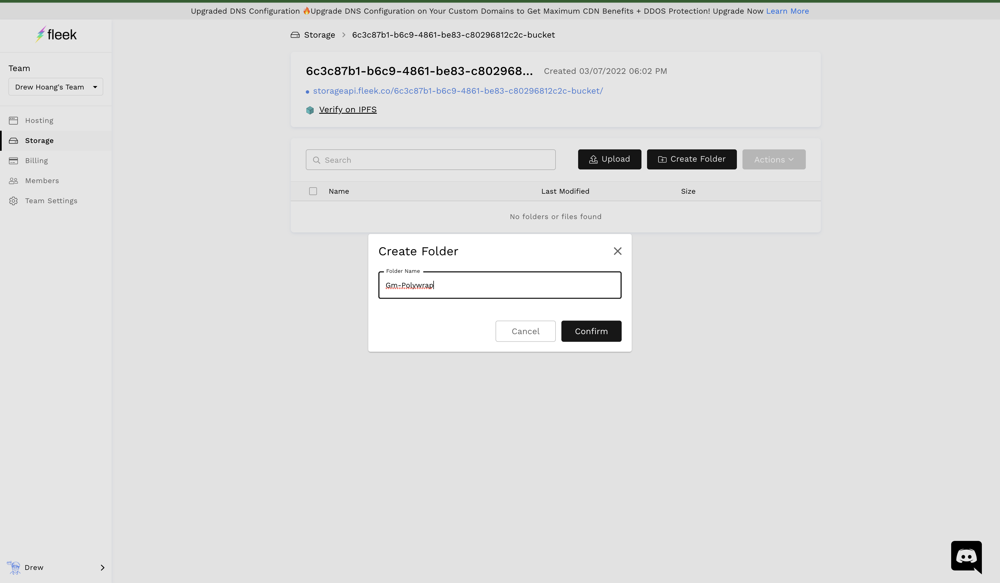
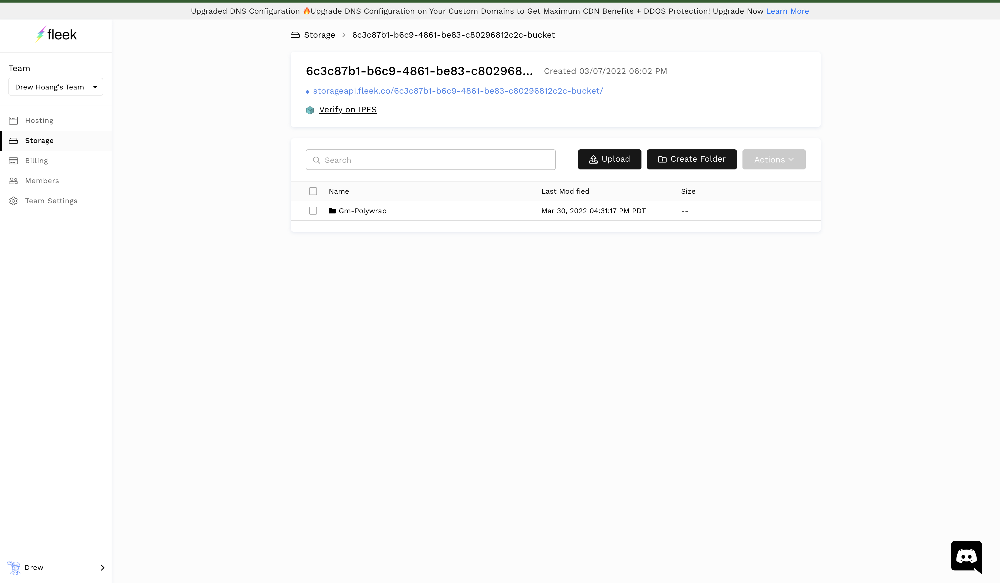
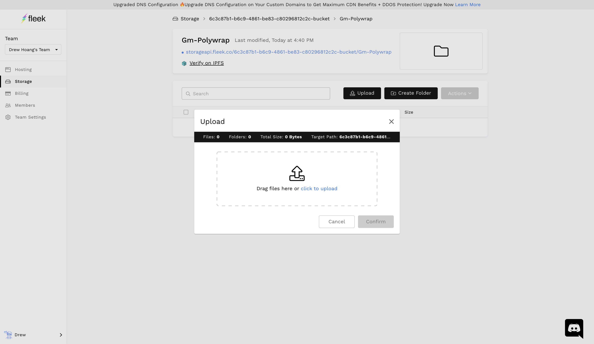
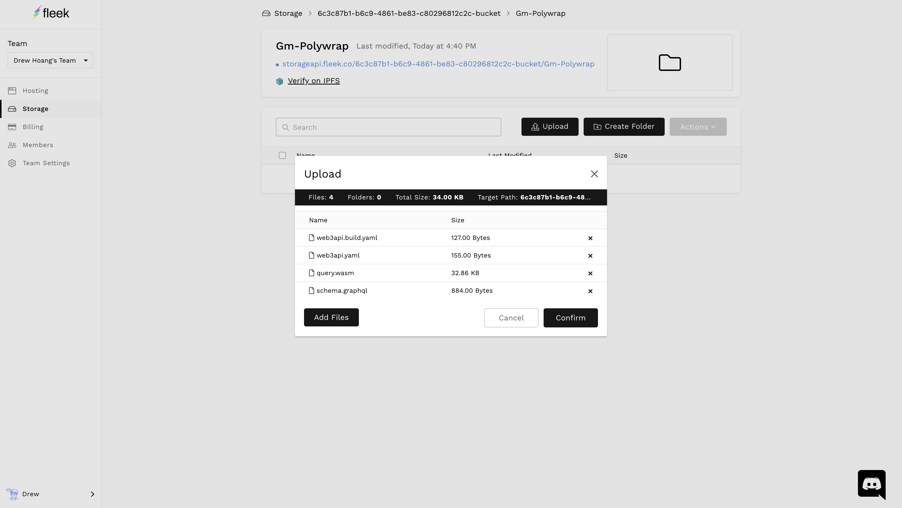

## **Introduction**

In this 5 step guide, we'll walk you through how to deploy your Polywrapper to [Fleek](https://fleek.co/) so that other dapps could integrate it into their dapps!

## **Table of Contents**
<details>
    <summary>Click to expand</summary>

  * [Introduction](#introduction)
  * [What you need to get started](#what-you-need-to-get-started)
  * [Step 1. Clone the polywrap demo project](#step-1-clone-the-polywrap-demo-project)
  * [Step 2. Pull the polywrap metadata](#step-2-git-pull-metadata)
  * [Step 3. Build the wrapper ](#step-3-build-the-wrapper)
  * [Step 4. Upload the build folder to Fleek](#step-4-upload-the-build-folder-to-fleek)
  * [Step 5. Verifying the package on IPFS ](#step-5-verifying-the-package-on-ipfs)

</details>

### What is Fleek ?
Fleek is the easiest way to build, deploy, and host websites & apps on [IPFS](https://ipfs.io/)
 Fleek provides one seamless workflow with everything you need to build fast, modern sites & web apps hosted on IPFS


### What you need to get started:
* We'll be using the [Polywrap Demos](https://github.com/polywrap/demos) repo for this guide. 
* 💚 [Node. js](https://nodejs.org/en/) 
* ⚡ [Fleek](https://fleek.co/)
* 🐳 [Docker](https://www.docker.com/)
* 🧶[Yarn](https://classic.yarnpkg.com/en/)
    * Versions:  `node >=10.0.0` or `yarn >=1.0.0`
* 🔸 [Git](https://git-scm.com/downloads)


### Step 1. Clone the polywrap demo project  

```bash
git clone https://github.com/polywrap/demos.git
```

### Step 2. Git pull metadata
Then, we will check out the demo branch with the metafiles already set up:

```bash
git pull origin polywrap-metadata
```

### Step 3. Build the wrapper
Now, we can build the sample Polywrapper with the following commands:

```bash
nvm use
yarn
yarn build
```

Your `build` folder should be generated now. Copy and paste the `./web3api.meta.yaml` and `./meta` files into the `build` folder.

### Step 4.  **Upload the build folder to Fleek**

Make sure you signup for a Fleek account. 

* On the left-hand side menu of your `Fleek` 
* Account page click on the `"Storage"` link.


* Then, click `"Create Folder"`

Example: `Gm-Polywrap`



* Click `Confirm` to create the folder 



* Click the Folder 
* After that, click `"Upload"` 




* Select the contents of your `build` folder onto `Fleek`



* Click `Confirm`

:::tip
Due to current Filecoin deal size limitation, files are batched together across Fleek products and uploaded as one Filecoin

So it might take 24-48 hours depending on Fleek usage for a content to appear in ipfs
:::


### Step 5.  **Verifying the package on IPFS**


Click the   `"Verify on IPFS"`   button. 

You will get an IPFS hash! 

For an example of what you should see, visit this [IPFS link](https://ipfs.fleek.co/ipfs/QmQLsx7sxkLrXwh8dPmF2MTWJmgB5C2FmWYth11i7oL3vN).

Now that you have the IPFS hash, you can use it as a value in the URI property of your Polywrap queries to access the mutation and query functions on this Polywrapper. 

You can also register an ENS domain and have it resolved to this IPFS content.
